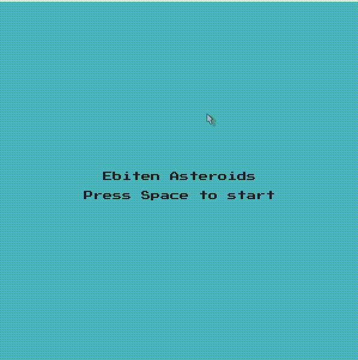

# Asteroids w/ Go

## About the Project
An Asteroids clone made with Go and Ebitengine.

### Demo 


### Built With
- [Golang](https://go.dev/) 1.20.4
- [Ebitengine](https://ebitengine.org/) 1.12.12 

## Getting Started
1) Before getting started visit the [Ebitengine Installation Guide](https://ebitengine.org/en/documents/install.html) and make sure you have all the dependencies on your machine. You will require Go 1.18+ and a C Compiler for your machine.

2) Setup this go project
```
go install
```

3) Build and start the game using, 
```
make
```

## Contact
Nicholas Chumney - [nicholas.chumney@outlook.com](nicholas.chumney@outlook.com)
